# SigScan Architecture

## Table of Contents
- [Overview](#overview)
- [System Architecture](#system-architecture)
- [Core Components](#core-components)
- [Data Flow](#data-flow)
- [Parser Engine](#parser-engine)
- [Extension Integration](#extension-integration)
- [Performance Optimizations](#performance-optimizations)

## Overview

SigScan is a VS Code extension and CLI tool that automatically extracts function signatures, event signatures, and custom error signatures from Solidity smart contracts. The architecture is designed for performance, extensibility, and developer experience.

## System Architecture

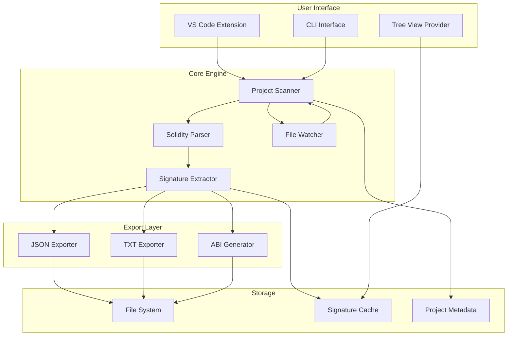
```mermaid
graph TB
    subgraph "User Interface"
        A[VS Code Extension]
        B[CLI Interface]
        C[Tree View Provider]
    end
    
    subgraph "Core Engine"
        D[Project Scanner]
        E[Solidity Parser]
        F[Signature Extractor]
        G[File Watcher]
    end
    
    subgraph "Export Layer"
        H[JSON Exporter]
        I[TXT Exporter]
        J[ABI Generator]
    end
    
    subgraph "Storage"
        K[File System]
        L[Signature Cache]
        M[Project Metadata]
    end
    
    A --> D
    B --> D
    D --> E
    E --> F
    F --> H
    F --> I
    F --> J
    H --> K
    I --> K
    J --> K
    D --> G
    G --> D
    F --> L
    D --> M
    C --> L
```

## Core Components

### 1. Project Scanner

The scanner is responsible for discovering Solidity files and determining project structure.

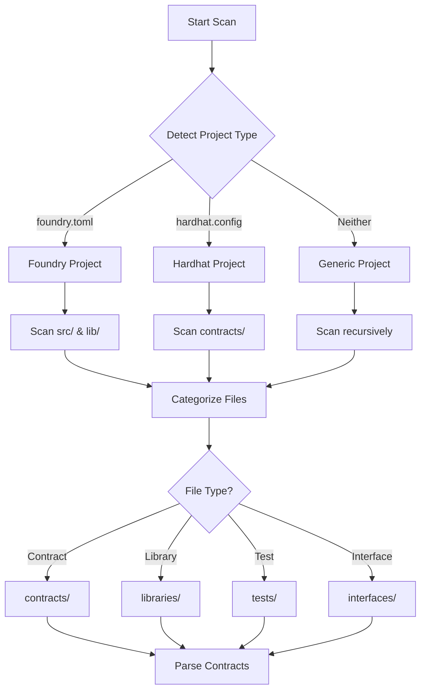
```mermaid
flowchart TD
    A[Start Scan] --> B{Detect Project Type}
    B -->|foundry.toml| C[Foundry Project]
    B -->|hardhat.config| D[Hardhat Project]
    B -->|Neither| E[Generic Project]
    
    C --> F[Scan src/ & lib/]
    D --> G[Scan contracts/]
    E --> H[Scan recursively]
    
    F --> I[Categorize Files]
    G --> I
    H --> I
    
    I --> J{File Type?}
    J -->|Contract| K[contracts/]
    J -->|Library| L[libraries/]
    J -->|Test| M[tests/]
    J -->|Interface| N[interfaces/]
    
    K --> O[Parse Contracts]
    L --> O
    M --> O
    N --> O
```

**Key Features:**
- Automatic project type detection
- Recursive file discovery
- Smart categorization (contracts, libraries, tests, interfaces)
- Ignore pattern support (node_modules, cache, etc.)

### 2. Solidity Parser

The parser uses a multi-stage regex-based approach to extract signatures with high accuracy.

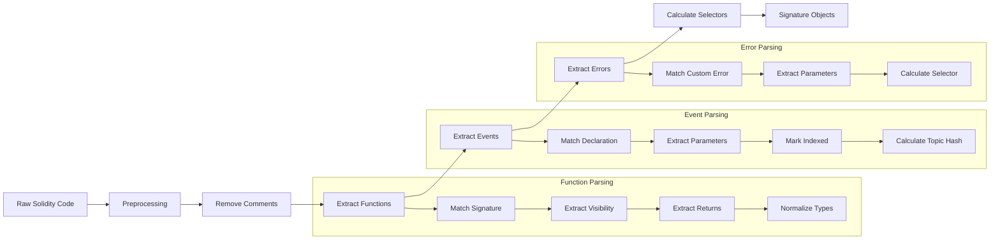
```mermaid
flowchart LR
    A[Raw Solidity Code] --> B[Preprocessing]
    B --> C[Remove Comments]
    C --> D[Extract Functions]
    D --> E[Extract Events]
    E --> F[Extract Errors]
    F --> G[Calculate Selectors]
    G --> H[Signature Objects]
    
    subgraph "Function Parsing"
        D --> D1[Match Signature]
        D1 --> D2[Extract Visibility]
        D2 --> D3[Extract Returns]
        D3 --> D4[Normalize Types]
    end
    
    subgraph "Event Parsing"
        E --> E1[Match Declaration]
        E1 --> E2[Extract Parameters]
        E2 --> E3[Mark Indexed]
        E3 --> E4[Calculate Topic Hash]
    end
    
    subgraph "Error Parsing"
        F --> F1[Match Custom Error]
        F1 --> F2[Extract Parameters]
        F2 --> F3[Calculate Selector]
    end
```

**Parser Stages:**

1. **Preprocessing**: Remove comments, normalize whitespace
2. **Function Extraction**: Regex matching for function declarations
3. **Event Extraction**: Match event declarations with indexed parameters
4. **Error Extraction**: Match custom error declarations
5. **Selector Calculation**: Keccak256 hash of normalized signatures

### 3. Signature Extractor

The extractor transforms parsed data into standardized signature objects.

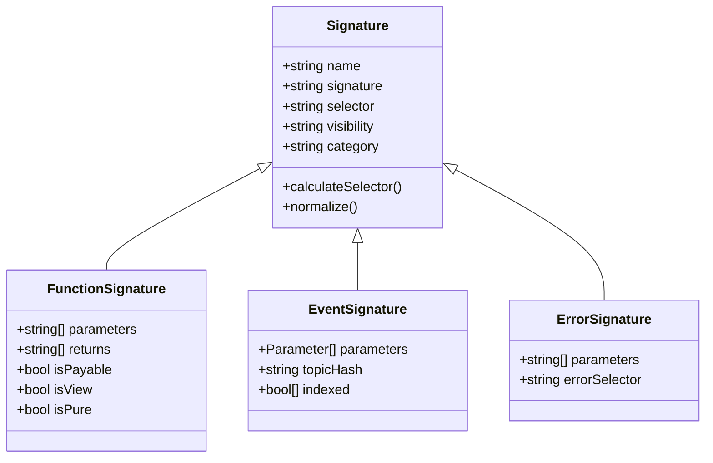
```mermaid
classDiagram
    class Signature {
        +string name
        +string signature
        +string selector
        +string visibility
        +string category
        +calculateSelector()
        +normalize()
    }
    
    class FunctionSignature {
        +string[] parameters
        +string[] returns
        +bool isPayable
        +bool isView
        +bool isPure
    }
    
    class EventSignature {
        +Parameter[] parameters
        +string topicHash
        +bool[] indexed
    }
    
    class ErrorSignature {
        +string[] parameters
        +string errorSelector
    }
    
    Signature <|-- FunctionSignature
    Signature <|-- EventSignature
    Signature <|-- ErrorSignature
```

## Data Flow

### Scan Operation Flow

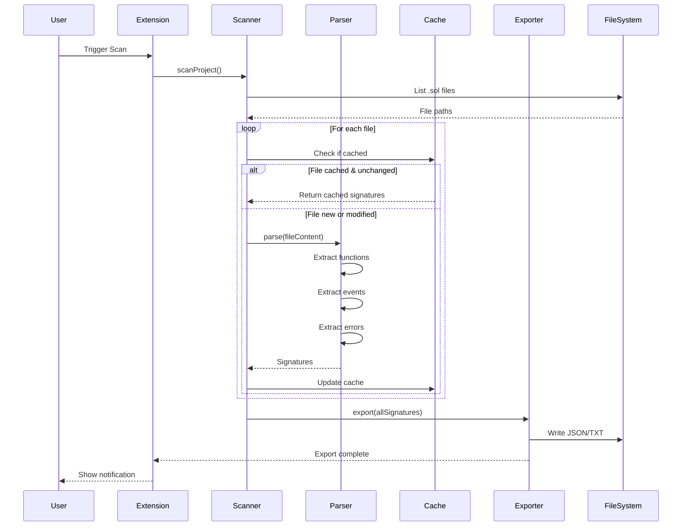
```mermaid
sequenceDiagram
    participant User
    participant Extension
    participant Scanner
    participant Parser
    participant Cache
    participant Exporter
    participant FileSystem
    
    User->>Extension: Trigger Scan
    Extension->>Scanner: scanProject()
    Scanner->>FileSystem: List .sol files
    FileSystem-->>Scanner: File paths
    
    loop For each file
        Scanner->>Cache: Check if cached
        alt File cached & unchanged
            Cache-->>Scanner: Return cached signatures
        else File new or modified
            Scanner->>Parser: parse(fileContent)
            Parser->>Parser: Extract functions
            Parser->>Parser: Extract events
            Parser->>Parser: Extract errors
            Parser-->>Scanner: Signatures
            Scanner->>Cache: Update cache
        end
    end
    
    Scanner->>Exporter: export(allSignatures)
    Exporter->>FileSystem: Write JSON/TXT
    Exporter-->>Extension: Export complete
    Extension-->>User: Show notification
```

### Watch Mode Flow

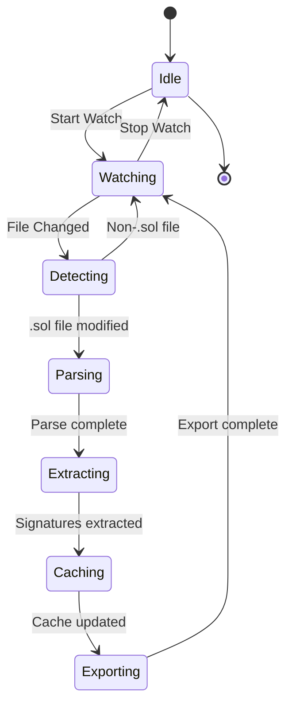
```mermaid
stateDiagram-v2
    [*] --> Idle
    Idle --> Watching: Start Watch
    Watching --> Detecting: File Changed
    Detecting --> Parsing: .sol file modified
    Detecting --> Watching: Non-.sol file
    Parsing --> Extracting: Parse complete
    Extracting --> Caching: Signatures extracted
    Caching --> Exporting: Cache updated
    Exporting --> Watching: Export complete
    Watching --> Idle: Stop Watch
    Idle --> [*]
```

## Parser Engine

### Regex Patterns

The parser uses carefully crafted regex patterns for accuracy:

```javascript
// Function signature pattern
const FUNCTION_PATTERN = /function\s+(\w+)\s*\((.*?)\)\s*(public|external|internal|private)?\s*(view|pure|payable)?\s*(returns\s*\((.*?)\))?/gs

// Event signature pattern  
const EVENT_PATTERN = /event\s+(\w+)\s*\((.*?)\)/gs

// Error signature pattern
const ERROR_PATTERN = /error\s+(\w+)\s*\((.*?)\)/gs

// Parameter extraction
const PARAM_PATTERN = /(\w+(?:\[\])?)(?:\s+indexed)?\s+(\w+)?/g
```

### Signature Calculation Algorithm

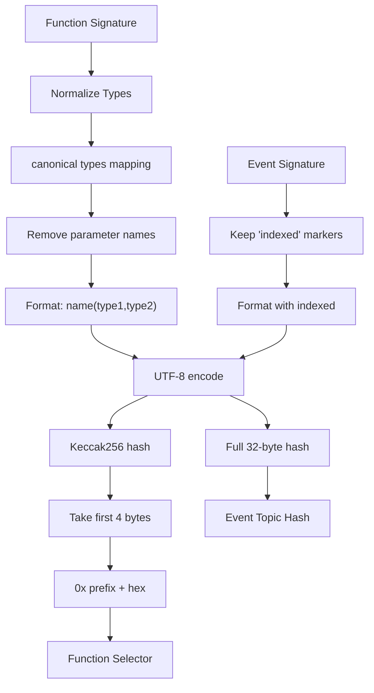
```mermaid
flowchart TD
    A[Function Signature] --> B[Normalize Types]
    B --> C[canonical types mapping]
    C --> D[Remove parameter names]
    D --> E[Format: name#40;type1,type2#41;]
    E --> F[UTF-8 encode]
    F --> G[Keccak256 hash]
    G --> H[Take first 4 bytes]
    H --> I[0x prefix + hex]
    I --> J[Function Selector]
    
    K[Event Signature] --> L[Keep 'indexed' markers]
    L --> M[Format with indexed]
    M --> F
    F --> N[Full 32-byte hash]
    N --> O[Event Topic Hash]
```

**Type Normalization Examples:**
- `uint` → `uint256`
- `int` → `int256`
- `byte` → `bytes1`
- `uint256[]` → `uint256[]` (preserved)
- `mapping(address => uint256)` → Complex handling

## Extension Integration

### VS Code Extension Lifecycle

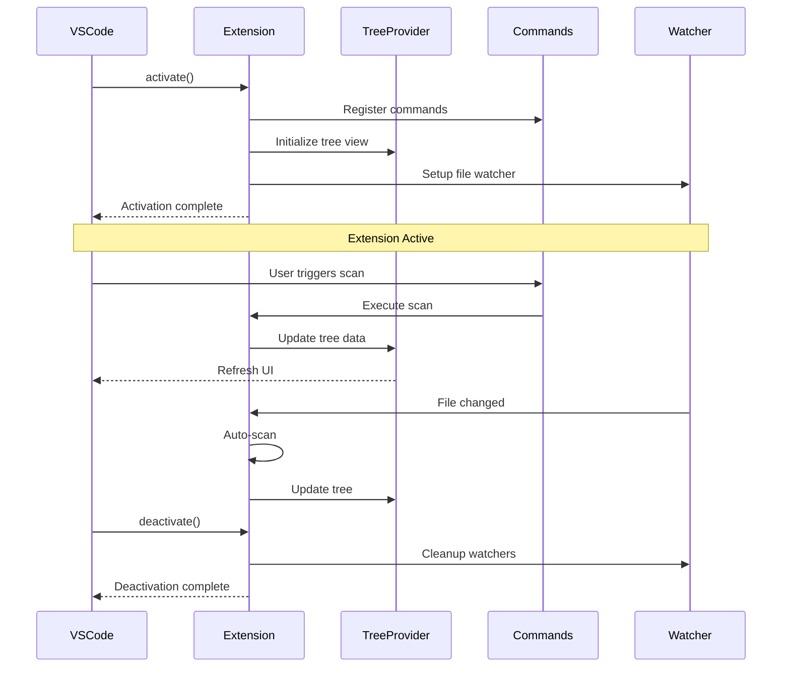
```mermaid
sequenceDiagram
    participant VSCode
    participant Extension
    participant TreeProvider
    participant Commands
    participant Watcher
    
    VSCode->>Extension: activate()
    Extension->>Commands: Register commands
    Extension->>TreeProvider: Initialize tree view
    Extension->>Watcher: Setup file watcher
    Extension-->>VSCode: Activation complete
    
    Note over VSCode,Watcher: Extension Active
    
    VSCode->>Commands: User triggers scan
    Commands->>Extension: Execute scan
    Extension->>TreeProvider: Update tree data
    TreeProvider-->>VSCode: Refresh UI
    
    Watcher->>Extension: File changed
    Extension->>Extension: Auto-scan
    Extension->>TreeProvider: Update tree
    
    VSCode->>Extension: deactivate()
    Extension->>Watcher: Cleanup watchers
    Extension-->>VSCode: Deactivation complete
```

### Tree View Structure

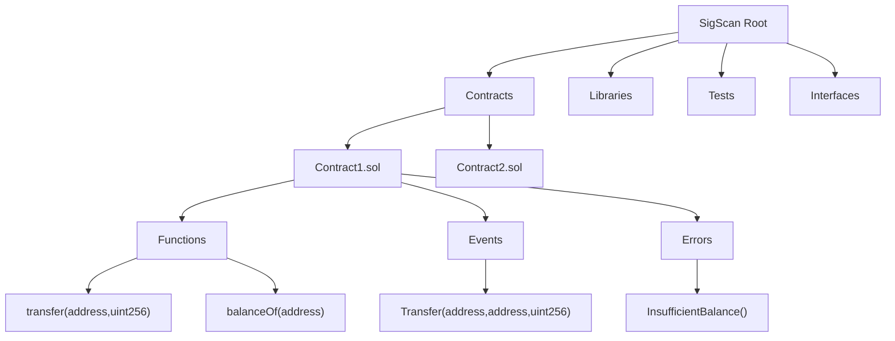
```mermaid
graph TD
    A[SigScan Root] --> B[Contracts]
    A --> C[Libraries]
    A --> D[Tests]
    A --> E[Interfaces]
    
    B --> B1[Contract1.sol]
    B --> B2[Contract2.sol]
    
    B1 --> B1F[Functions]
    B1 --> B1E[Events]
    B1 --> B1R[Errors]
    
    B1F --> B1F1[transfer#40;address,uint256#41;]
    B1F --> B1F2[balanceOf#40;address#41;]
    
    B1E --> B1E1[Transfer#40;address,address,uint256#41;]
    
    B1R --> B1R1[InsufficientBalance#40;#41;]
```

## Performance Optimizations

### 1. Caching Strategy

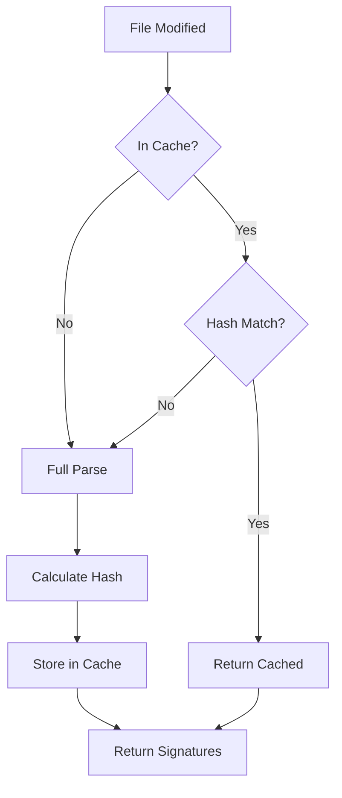
```mermaid
flowchart TD
    A[File Modified] --> B{In Cache?}
    B -->|No| C[Full Parse]
    B -->|Yes| D{Hash Match?}
    D -->|Yes| E[Return Cached]
    D -->|No| C
    C --> F[Calculate Hash]
    F --> G[Store in Cache]
    G --> H[Return Signatures]
    E --> H
```

**Cache Structure:**
```typescript
{
  "filePath": {
    "hash": "sha256_hash",
    "lastModified": timestamp,
    "signatures": {
      "functions": [...],
      "events": [...],
      "errors": [...]
    }
  }
}
```

### 2. Incremental Parsing

Only re-parse files that have changed since last scan:

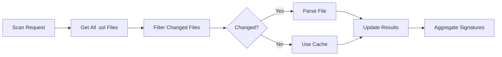
```mermaid
flowchart LR
    A[Scan Request] --> B[Get All .sol Files]
    B --> C[Filter Changed Files]
    C --> D{Changed?}
    D -->|Yes| E[Parse File]
    D -->|No| F[Use Cache]
    E --> G[Update Results]
    F --> G
    G --> H[Aggregate Signatures]
```

### 3. Parallel Processing

For large projects, files are parsed in parallel:

```javascript
const results = await Promise.all(
  files.map(file => parseFileAsync(file))
);
```

### 4. Deduplication

Signatures are deduplicated across the entire project:

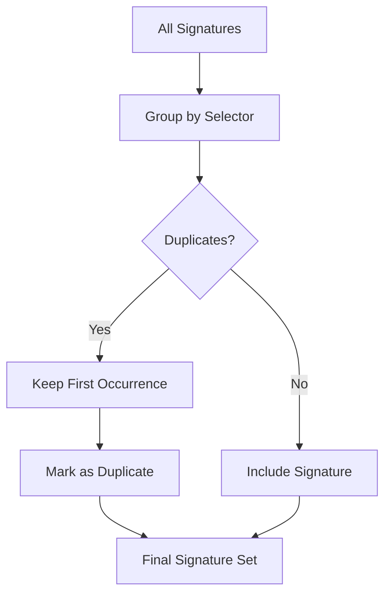
```mermaid
flowchart TD
    A[All Signatures] --> B[Group by Selector]
    B --> C{Duplicates?}
    C -->|Yes| D[Keep First Occurrence]
    C -->|No| E[Include Signature]
    D --> F[Mark as Duplicate]
    F --> G[Final Signature Set]
    E --> G
```

## Advanced Features Architecture

### ABI Generation

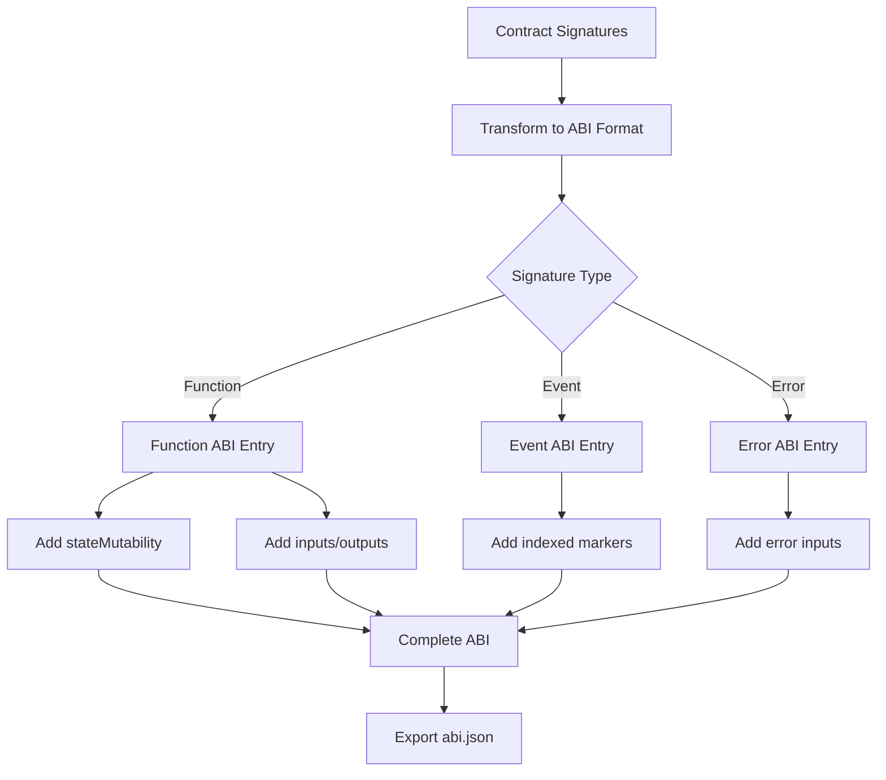
```mermaid
flowchart TD
    A[Contract Signatures] --> B[Transform to ABI Format]
    B --> C{Signature Type}
    C -->|Function| D[Function ABI Entry]
    C -->|Event| E[Event ABI Entry]
    C -->|Error| F[Error ABI Entry]
    
    D --> G[Add stateMutability]
    D --> H[Add inputs/outputs]
    E --> I[Add indexed markers]
    F --> J[Add error inputs]
    
    G --> K[Complete ABI]
    H --> K
    I --> K
    J --> K
    K --> L[Export abi.json]
```

### Gas Estimation

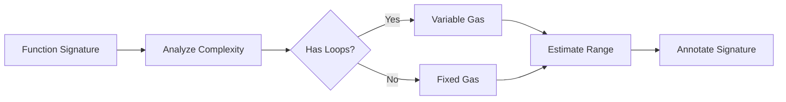
```mermaid
flowchart LR
    A[Function Signature] --> B[Analyze Complexity]
    B --> C{Has Loops?}
    C -->|Yes| D[Variable Gas]
    C -->|No| E[Fixed Gas]
    D --> F[Estimate Range]
    E --> F
    F --> G[Annotate Signature]
```

### Contract Size Analysis

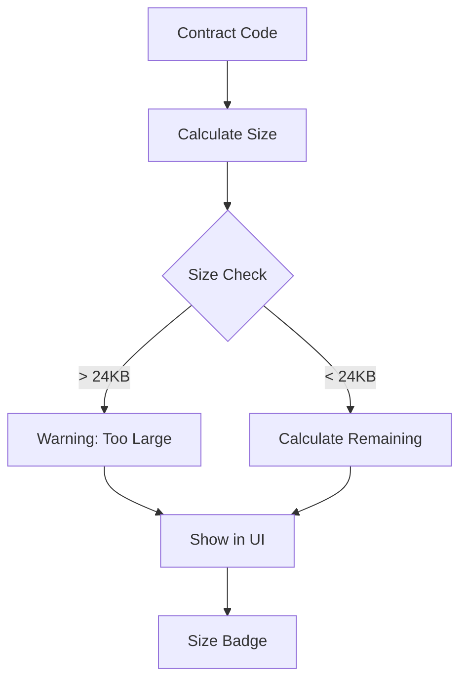
```mermaid
flowchart TD
    A[Contract Code] --> B[Calculate Size]
    B --> C{Size Check}
    C -->|> 24KB| D[Warning: Too Large]
    C -->|< 24KB| E[Calculate Remaining]
    D --> F[Show in UI]
    E --> F
    F --> G[Size Badge]
```

### Signature Verification

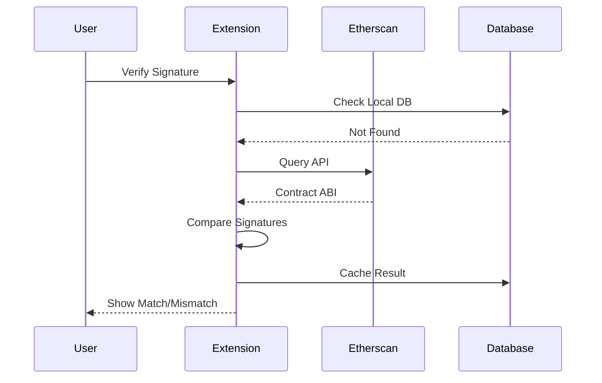
```mermaid
sequenceDiagram
    participant User
    participant Extension
    participant Etherscan
    participant Database
    
    User->>Extension: Verify Signature
    Extension->>Database: Check Local DB
    Database-->>Extension: Not Found
    Extension->>Etherscan: Query API
    Etherscan-->>Extension: Contract ABI
    Extension->>Extension: Compare Signatures
    Extension->>Database: Cache Result
    Extension-->>User: Show Match/Mismatch
```

## File Structure

```
sigscan/
├── src/
│   ├── core/               # Core scanning logic
│   │   ├── scanner.ts      # Project scanner
│   │   ├── parser.ts       # Solidity parser
│   │   ├── exporter.ts     # Signature exporter
│   │   ├── watcher.ts      # File watcher
│   │   └── cache.ts        # Caching system
│   ├── extension/          # VS Code extension
│   │   ├── extension.ts    # Extension entry
│   │   ├── manager.ts      # Scan manager
│   │   ├── commands.ts     # Command handlers
│   │   └── providers/      # Tree/UI providers
│   ├── features/           # Advanced features
│   │   ├── abi.ts          # ABI generation
│   │   ├── gas.ts          # Gas estimation
│   │   ├── verify.ts       # Etherscan verification
│   │   └── complexity.ts   # Code analysis
│   ├── cli/                # CLI interface
│   │   └── index.ts
│   └── utils/              # Utilities
│       └── helpers.ts
└── test/                   # Test suites
```

## Error Handling

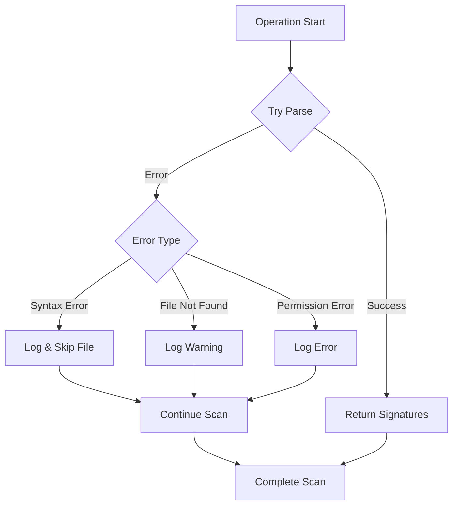
```mermaid
flowchart TD
    A[Operation Start] --> B{Try Parse}
    B -->|Success| C[Return Signatures]
    B -->|Error| D{Error Type}
    D -->|Syntax Error| E[Log & Skip File]
    D -->|File Not Found| F[Log Warning]
    D -->|Permission Error| G[Log Error]
    E --> H[Continue Scan]
    F --> H
    G --> H
    H --> I[Complete Scan]
    C --> I
```

## Configuration

```typescript
interface SigScanConfig {
  // Output settings
  outputFormat: 'json' | 'txt' | 'both';
  outputDirectory: string;
  
  // Parsing settings
  includeInternal: boolean;
  includePrivate: boolean;
  deduplicate: boolean;
  
  // Performance settings
  enableCache: boolean;
  parallelProcessing: boolean;
  maxFileSize: number;
  
  // Advanced features
  generateABI: boolean;
  estimateGas: boolean;
  checkContractSize: boolean;
  verifyOnEtherscan: boolean;
  
  // Exclusion patterns
  excludePaths: string[];
}
```

## Extension Points

The architecture supports plugins through:

1. **Custom Parsers**: Add support for other languages
2. **Custom Exporters**: New output formats
3. **Custom Analyzers**: Additional code analysis
4. **Custom UI Providers**: Enhanced visualizations

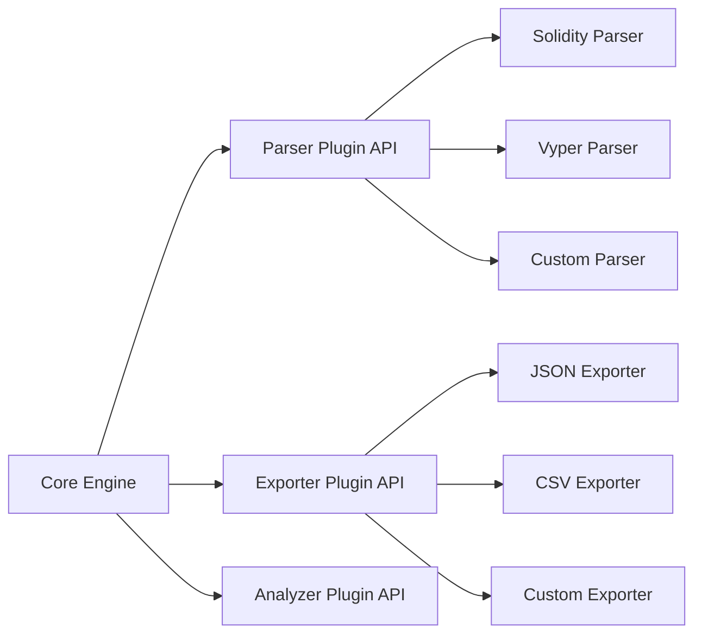
```mermaid
graph LR
    A[Core Engine] --> B[Parser Plugin API]
    A --> C[Exporter Plugin API]
    A --> D[Analyzer Plugin API]
    
    B --> E[Solidity Parser]
    B --> F[Vyper Parser]
    B --> G[Custom Parser]
    
    C --> H[JSON Exporter]
    C --> I[CSV Exporter]
    C --> J[Custom Exporter]
```

## Testing Strategy

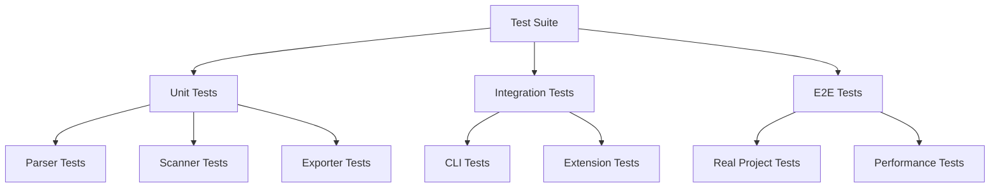
```mermaid
graph TD
    A[Test Suite] --> B[Unit Tests]
    A --> C[Integration Tests]
    A --> D[E2E Tests]
    
    B --> B1[Parser Tests]
    B --> B2[Scanner Tests]
    B --> B3[Exporter Tests]
    
    C --> C1[CLI Tests]
    C --> C2[Extension Tests]
    
    D --> D1[Real Project Tests]
    D --> D2[Performance Tests]
```

## Deployment Pipeline

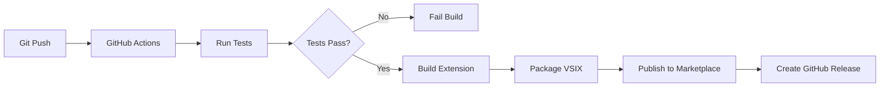
```mermaid
flowchart LR
    A[Git Push] --> B[GitHub Actions]
    B --> C[Run Tests]
    C --> D{Tests Pass?}
    D -->|No| E[Fail Build]
    D -->|Yes| F[Build Extension]
    F --> G[Package VSIX]
    G --> H[Publish to Marketplace]
    H --> I[Create GitHub Release]
```

---

## Advanced Features Architecture (v0.4.0)

### Real-Time Analysis System

```mermaid
graph TB
    subgraph "Editor Events"
        A[Text Change Event]
        B[Document Open]
        C[File Save]
    end
    
    subgraph "Real-Time Analyzer"
        D[Event Debouncer<br/>5-second cache]
        E[Content Hasher<br/>SHA-256]
        F[Cache Manager<br/>LRU Eviction]
    end
    
    subgraph "Analysis Pipeline"
        G[Parse Document]
        H[Gas Estimator]
        I[Size Analyzer]
        J[Complexity Analyzer]
    end
    
    subgraph "VS Code Integration"
        K[Diagnostics Panel]
        L[Inline Decorations]
        M[Hover Provider]
    end
    
    A --> D
    B --> D
    C --> D
    D --> E
    E --> F
    F -->|Cache Miss| G
    F -->|Cache Hit| K
    G --> H
    G --> I
    G --> J
    H --> K
    H --> L
    I --> K
    J --> K
    J --> L
    K --> M
```

### Feature Modules Integration

```mermaid
flowchart LR
    A[Scanner Result] --> B{Feature Router}
    
    B --> C[ABI Generator]
    B --> D[Gas Estimator]
    B --> E[Size Analyzer]
    B --> F[Complexity Analyzer]
    B --> G[Etherscan Verifier]
    B --> H[Signature Database]
    B --> I[Runtime Profiler]
    
    C --> J[Export Layer]
    D --> J
    E --> J
    F --> J
    G --> J
    H --> J
    I --> J
    
    J --> K[JSON Files]
    J --> L[Text Reports]
    J --> M[Output Channels]
```

### Runtime Gas Profiler Architecture

```mermaid
sequenceDiagram
    participant User
    participant VSCode
    participant Profiler
    participant Foundry
    participant FileWatcher
    participant Decorator
    
    User->>VSCode: Start Runtime Profiling
    VSCode->>Profiler: Activate Profiler
    Profiler->>FileWatcher: Watch .gas-snapshot
    
    User->>Foundry: forge test --gas-report
    Foundry->>Foundry: Execute Tests
    Foundry-->>FileWatcher: .gas-snapshot created
    
    FileWatcher->>Profiler: File Changed Event
    Profiler->>Profiler: Parse Gas Data
    Profiler->>Decorator: Update Decorations
    Decorator->>VSCode: Show Inline Costs
    
    User->>VSCode: Hover over Function
    VSCode->>Profiler: Request Metrics
    Profiler-->>VSCode: Return Actual Gas + Accuracy
```

### Gas Analysis Flow

```mermaid
flowchart TD
    A[Function Code] --> B{Analysis Type}
    
    B -->|Static| C[Pattern Detection]
    B -->|Runtime| D[Test Execution]
    
    C --> E[Storage Operations]
    C --> F[Loop Detection]
    C --> G[External Calls]
    C --> H[Math Operations]
    
    E --> I[Estimate Calculator]
    F --> I
    G --> I
    H --> I
    
    D --> J[Parse .gas-snapshot]
    J --> K[Extract Actual Costs]
    
    I --> L[Static Estimate]
    K --> M[Runtime Actual]
    
    L --> N{Compare}
    M --> N
    
    N --> O[Accuracy %]
    N --> P[Difference]
    N --> Q[Visual Feedback]
    
    Q --> R[Green: <5k gas]
    Q --> S[Yellow: 5k-20k]
    Q --> T[Orange: 20k-50k]
    Q --> U[Red: >50k]
```

### Complexity Analysis Pipeline

```mermaid
graph LR
    A[Source Code] --> B[Cyclomatic<br/>Complexity]
    A --> C[Cognitive<br/>Complexity]
    A --> D[Lines of Code]
    
    B --> E[Decision Points]
    B --> F[Branch Count]
    
    C --> G[Nesting Level]
    C --> H[Control Flow]
    
    D --> I[Clean LOC]
    
    E --> J[Complexity Score]
    F --> J
    G --> J
    H --> J
    I --> J
    
    J --> K{Rating}
    K -->|1-5| L[Low: A]
    K -->|6-10| M[Medium: B]
    K -->|11-20| N[High: C]
    K -->|21+| O[Very High: D-F]
    
    L --> P[Maintainability Index]
    M --> P
    N --> P
    O --> P
```

### Cache System Architecture

```mermaid
flowchart TD
    A[Analysis Request] --> B{Check Cache}
    B -->|Hit| C[Return Cached Result]
    B -->|Miss| D[Hash Content<br/>SHA-256]
    
    D --> E[Run Analysis]
    E --> F[Store Result]
    F --> G{Cache Full?}
    
    G -->|No| H[Add to Cache]
    G -->|Yes| I[LRU Eviction]
    
    I --> J[Remove Oldest]
    J --> H
    
    H --> K[Set TTL: 5s]
    K --> L[Return Result]
    
    C --> M{TTL Expired?}
    M -->|No| L
    M -->|Yes| D
```

### Extension Command Flow

```mermaid
stateDiagram-v2
    [*] --> Idle
    
    Idle --> Scanning: sigscan.scanProject
    Scanning --> ScanComplete: Success
    Scanning --> Error: Failure
    ScanComplete --> Idle
    Error --> Idle
    
    ScanComplete --> GeneratingABI: sigscan.generateABI
    GeneratingABI --> ABIComplete
    ABIComplete --> Idle
    
    ScanComplete --> EstimatingGas: sigscan.estimateGas
    EstimatingGas --> GasComplete
    GasComplete --> Idle
    
    ScanComplete --> CheckingSize: sigscan.checkContractSize
    CheckingSize --> SizeComplete
    SizeComplete --> Idle
    
    ScanComplete --> AnalyzingComplexity: sigscan.analyzeComplexity
    AnalyzingComplexity --> ComplexityComplete
    ComplexityComplete --> Idle
    
    ScanComplete --> VerifyingEtherscan: sigscan.verifyEtherscan
    VerifyingEtherscan --> VerifyComplete
    VerifyComplete --> Idle
    
    Idle --> RuntimeProfiling: sigscan.startRuntimeProfiling
    RuntimeProfiling --> ProfilingActive
    ProfilingActive --> Idle: sigscan.stopRuntimeProfiling
```

### Data Storage and Retrieval

```mermaid
erDiagram
    PROJECT ||--o{ CONTRACT : contains
    CONTRACT ||--o{ FUNCTION : has
    CONTRACT ||--o{ EVENT : has
    CONTRACT ||--o{ ERROR : has
    
    FUNCTION ||--o{ PARAMETER : has
    EVENT ||--o{ PARAMETER : has
    ERROR ||--o{ PARAMETER : has
    
    FUNCTION ||--|| GAS_ESTIMATE : analyzed_by
    FUNCTION ||--|| COMPLEXITY_METRIC : analyzed_by
    CONTRACT ||--|| SIZE_INFO : analyzed_by
    
    FUNCTION ||--o| RUNTIME_GAS : measured_in
    
    PROJECT {
        string type
        string rootPath
        array contractDirs
        Map contracts
    }
    
    CONTRACT {
        string name
        string filePath
        array functions
        array events
        array errors
        Date lastModified
    }
    
    FUNCTION {
        string name
        string signature
        string selector
        string visibility
        string stateMutability
    }
    
    GAS_ESTIMATE {
        int min
        int max
        int average
        string complexity
    }
    
    RUNTIME_GAS {
        int actualGas
        int estimatedGas
        float accuracy
        string testName
    }
    
    COMPLEXITY_METRIC {
        int cyclomaticComplexity
        int cognitiveComplexity
        int linesOfCode
        int maintainabilityIndex
        string rating
    }
    
    SIZE_INFO {
        int estimatedSize
        float percentage
        string status
    }
```

### Event-Driven Architecture

```mermaid
sequenceDiagram
    participant FileSystem
    participant Watcher
    participant Scanner
    participant Analyzer
    participant Cache
    participant UI
    
    FileSystem->>Watcher: File Modified
    Watcher->>Watcher: Debounce (300ms)
    Watcher->>Scanner: Trigger Scan
    
    Scanner->>Scanner: Parse File
    Scanner->>Cache: Check Cache
    
    alt Cache Hit
        Cache-->>Scanner: Return Cached
        Scanner-->>UI: Update UI
    else Cache Miss
        Scanner->>Analyzer: Analyze Contract
        Analyzer->>Analyzer: Gas Estimation
        Analyzer->>Analyzer: Complexity Analysis
        Analyzer->>Analyzer: Size Check
        Analyzer-->>Scanner: Analysis Results
        Scanner->>Cache: Store Results
        Scanner-->>UI: Update UI
    end
    
    UI->>UI: Update Decorations
    UI->>UI: Update Diagnostics
    UI->>UI: Refresh Tree View
```

### Multi-Network Etherscan Integration

```mermaid
graph TB
    A[Verify Request] --> B{Select Network}
    
    B --> C[Mainnet<br/>api.etherscan.io]
    B --> D[Goerli<br/>api-goerli.etherscan.io]
    B --> E[Sepolia<br/>api-sepolia.etherscan.io]
    B --> F[Polygon<br/>api.polygonscan.com]
    B --> G[Arbitrum<br/>api.arbiscan.io]
    B --> H[Optimism<br/>api-optimistic.etherscan.io]
    
    C --> I[Get API Key]
    D --> I
    E --> I
    F --> I
    G --> I
    H --> I
    
    I --> J[Fetch Contract ABI]
    J --> K[Compare Signatures]
    K --> L{Match?}
    
    L -->|Yes| M[Verification Success]
    L -->|No| N[Show Mismatches]
    
    M --> O[Display Results]
    N --> O
```

---

## Contributing

See [CONTRIBUTING.md](CONTRIBUTING.md) for development workflow and architecture guidelines.

## Performance Benchmarks

| Project Size | Files | Functions | Scan Time | Memory | Real-Time Update |
|--------------|-------|-----------|-----------|--------|------------------|
| Small        | 10    | 100       | < 1s      | 50MB   | < 50ms (cached)  |
| Medium       | 50    | 500       | < 3s      | 150MB  | < 100ms (cached) |
| Large        | 200   | 2000      | < 10s     | 300MB  | < 200ms (cached) |
| Huge         | 1000  | 10000     | < 30s     | 500MB  | < 300ms (cached) |

### Cache Performance
- **Cache Hit Rate**: ~85% during active editing
- **TTL**: 5 seconds
- **Hash Algorithm**: SHA-256
- **Eviction Policy**: LRU (Least Recently Used)

*Benchmarks on Intel i7, 16GB RAM*
